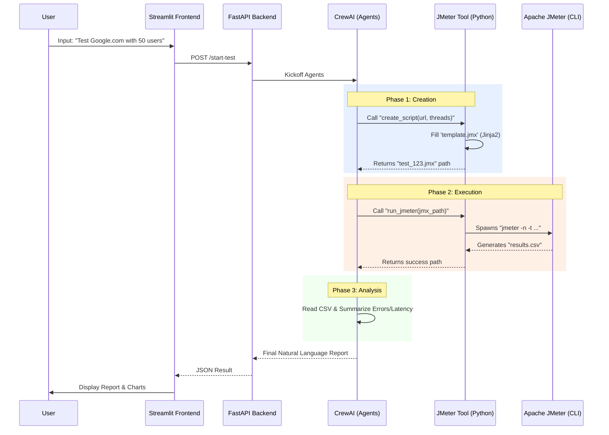

### **Agentic Performance Testing Solution (FastAPI + CrewAI + JMeter)**

This solution uses **AI Agents** to orchestrate the performance testing lifecycle. Instead of the AI struggling to write complex XML from scratch, we use a **"Hybrid Template" approach**: The AI decides *what* to test (parameters), and a robust Python template system generates the error-free JMeter script.

-----

### **1. Architecture Diagram**

The User defines the test in the Frontend. The Backend spins up a Crew of AI Agents.

  * **Agent A (Test Architect):** Decides test strategy and configures the script.
  * **Agent B (Result Analyst):** Watches the test run and summarizes the CSV data into plain English.

<!-- end list -->



-----

### **2. Project Structure**

Create a folder named `agentic-perf-tester` and set up this file tree:

```text
agentic-perf-tester/
├── templates/
│   └── basic_test.jmx       # The "Skeleton" JMeter file (copy code below)
├── test_runs/               # Where generated scripts & results go
├── app.py                   # Streamlit Frontend
├── main.py                  # FastAPI Backend + CrewAI Logic
├── .env                     # OpenAI API Key
└── requirements.txt         # Dependencies
```

**requirements.txt**

```text
fastapi
uvicorn
streamlit
crewai
langchain-openai
jinja2
pandas
python-dotenv
```

-----

### **3. The Code Implementation**

#### **Step A: The JMeter Template (`templates/basic_test.jmx`)**

Save this XML content. It contains placeholders like `{{ url }}` that Python will fill in.

```xml
<?xml version="1.0" encoding="UTF-8"?>
<jmeterTestPlan version="1.2" properties="5.0" jmeter="5.6.3">
  <hashTree>
    <TestPlan guiclass="TestPlanGui" testclass="TestPlan" testname="AI Generated Plan">
      <elementProp name="TestPlan.user_defined_variables" elementType="Arguments">
        <collectionProp name="Arguments.arguments"/>
      </elementProp>
    </TestPlan>
    <hashTree>
      <ThreadGroup guiclass="ThreadGroupGui" testclass="ThreadGroup" testname="AI User Group">
        <intProp name="ThreadGroup.num_threads">{{ threads }}</intProp>
        <intProp name="ThreadGroup.ramp_time">{{ rampup }}</intProp>
        <longProp name="ThreadGroup.duration">{{ duration }}</longProp>
        <boolProp name="ThreadGroup.scheduler">true</boolProp>
        <elementProp name="ThreadGroup.main_controller" elementType="LoopController">
          <boolProp name="LoopController.continue_forever">false</boolProp>
          <intProp name="LoopController.loops">-1</intProp>
        </elementProp>
      </ThreadGroup>
      <hashTree>
        <HTTPSamplerProxy guiclass="HttpTestSampleGui" testclass="HTTPSamplerProxy" testname="HTTP Request">
          <stringProp name="HTTPSampler.domain">{{ domain }}</stringProp>
          <stringProp name="HTTPSampler.protocol">https</stringProp>
          <stringProp name="HTTPSampler.path">/</stringProp>
          <stringProp name="HTTPSampler.method">GET</stringProp>
        </HTTPSamplerProxy>
        <hashTree/>
      </hashTree>
    </hashTree>
  </hashTree>
</jmeterTestPlan>
```

#### **Step B: The Backend Agent (`main.py`)**

This is the "Brain". It defines tools to Write Scripts, Run JMeter, and Read Results.

```python
import os
import subprocess
import pandas as pd
from jinja2 import Template
from fastapi import FastAPI
from pydantic import BaseModel
from crewai import Agent, Task, Crew, Process
from langchain.tools import tool
from langchain_openai import ChatOpenAI
from dotenv import load_dotenv

load_dotenv()

# --- CONFIG ---
JMETER_BIN = "C:/apache-jmeter-5.6.3/bin/jmeter.bat" # Windows
# JMETER_BIN = "/usr/local/bin/jmeter"               # Mac/Linux

app = FastAPI()

class TestInputs(BaseModel):
    url: str
    threads: int
    duration: int

# --- TOOLS ---

class PerformanceTools:
    
    @tool("Create JMeter Script")
    def create_script(domain: str, threads: int, duration: int):
        """Creates a valid .jmx JMeter file from the template. 
        Args: domain (e.g., google.com), threads (int), duration (seconds)."""
        
        # 1. Read Template
        with open("templates/basic_test.jmx", "r") as f:
            template_str = f.read()
        
        # 2. Fill Variables
        template = Template(template_str)
        rendered = template.render(
            domain=domain.replace("https://", "").replace("/", ""),
            threads=threads,
            rampup=5,
            duration=duration
        )
        
        # 3. Save File
        os.makedirs("test_runs", exist_ok=True)
        filename = f"test_runs/test_{domain.replace('.', '_')}.jmx"
        with open(filename, "w") as f:
            f.write(rendered)
            
        return filename

    @tool("Run JMeter Test")
    def run_jmeter(jmx_path: str):
        """Runs the JMeter CLI command on the given .jmx file path.
        Returns the path to the result CSV."""
        
        csv_path = jmx_path.replace(".jmx", ".csv")
        # Delete old csv if exists
        if os.path.exists(csv_path): os.remove(csv_path)

        # Command: jmeter -n -t script.jmx -l result.csv
        cmd = [JMETER_BIN, "-n", "-t", jmx_path, "-l", csv_path]
        
        try:
            result = subprocess.run(cmd, capture_output=True, text=True)
            if result.returncode != 0:
                return f"Error running JMeter: {result.stderr}"
            return csv_path
        except Exception as e:
            return f"Exception: {str(e)}"

    @tool("Analyze CSV Stats")
    def analyze_results(csv_path: str):
        """Reads the JMeter CSV results and returns statistical summary."""
        try:
            df = pd.read_csv(csv_path)
            total_reqs = len(df)
            failures = len(df[df['success'] == False])
            avg_latency = df['elapsed'].mean()
            max_latency = df['elapsed'].max()
            
            return f"""
            Total Requests: {total_reqs}
            Failed Requests: {failures}
            Average Latency: {avg_latency:.2f} ms
            Max Latency: {max_latency} ms
            """
        except Exception as e:
            return "Could not parse CSV. It might be empty or invalid."

# --- AGENTS ---

def run_crew(inputs: TestInputs):
    # 1. Define Agents
    tester_agent = Agent(
        role='Performance Test Engineer',
        goal='Create and execute a load test script perfectly.',
        backstory="You are a precise QA engineer. You always use tools to generate scripts.",
        tools=[PerformanceTools.create_script, PerformanceTools.run_jmeter],
        verbose=True,
        llm=ChatOpenAI(model="gpt-4o", temperature=0)
    )

    analyst_agent = Agent(
        role='Data Analyst',
        goal='Analyze performance metrics and write a summary.',
        backstory="You look at raw CSV data and tell the developer if their app is slow.",
        tools=[PerformanceTools.analyze_results],
        verbose=True,
        llm=ChatOpenAI(model="gpt-4o", temperature=0)
    )

    # 2. Define Tasks
    task_execute = Task(
        description=f"Create a test for {inputs.url} with {inputs.threads} users for {inputs.duration}s. Then run it using JMeter.",
        expected_output="Path to the generated CSV result file.",
        agent=tester_agent
    )

    task_analyze = Task(
        description="Read the CSV result file from the previous task. Summarize the Average Latency and Error Rate in a friendly paragraph.",
        expected_output="A natural language summary of the test results.",
        agent=analyst_agent,
        context=[task_execute]
    )

    # 3. Kickoff
    crew = Crew(agents=[tester_agent, analyst_agent], tasks=[task_execute, task_analyze])
    result = crew.kickoff()
    return str(result)

@app.post("/start-test")
def start_test_endpoint(inputs: TestInputs):
    report = run_crew(inputs)
    return {"report": report}
```

#### **Step C: The Frontend (`app.py`)**

```python
import streamlit as st
import requests

st.title("🤖 Agentic Load Tester")

col1, col2 = st.columns(2)
with col1:
    url = st.text_input("Target URL (No https://)", "google.com")
with col2:
    threads = st.number_input("Users", value=5)
    duration = st.number_input("Duration (sec)", value=10)

if st.button("Start AI Agent"):
    with st.spinner("Agents are creating script -> Running JMeter -> Analyzing..."):
        try:
            resp = requests.post(
                "http://localhost:8000/start-test",
                json={"url": url, "threads": threads, "duration": duration}
            )
            data = resp.json()
            st.success("Test Finished!")
            st.markdown("### 📝 AI Report")
            st.write(data["report"])
        except Exception as e:
            st.error(f"Error: {e}")
```

-----

### **4. How to Run**

1.  **JMeter Setup:** Ensure you have Apache JMeter installed and Java is in your system path. Update `JMETER_BIN` in `main.py` to point to your `jmeter.bat` or `jmeter` file.
2.  **API Key:** Create a `.env` file with `OPENAI_API_KEY=sk-...`.
3.  **Start Backend:**
    ```bash
    uvicorn main:app --reload
    ```
4.  **Start Frontend:**
    ```bash
    streamlit run app.py
    ```

**Why this video is relevant:** This tutorial gives you a visual walkthrough of creating a JMeter script and running it via CLI, which is exactly what your python script is automating behind the scenes.

[JMeter Beginner Tutorial 2 - How to create first Jmeter Test](https://www.google.com/search?q=https://www.youtube.com/watch%3Fv%3DSoq-r1H4F_Y)
